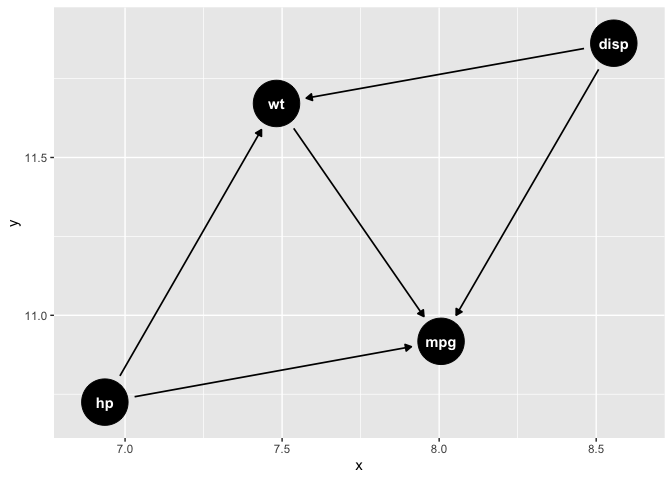

<!-- README.md is generated from README.Rmd. Please edit that file -->

# dagger

<!-- badges: start -->

[](https://www.tidyverse.org/lifecycle/#experimental)
[](https://github.com/asshah4/dagger/graphs/commit-activity)
[](https://github.com/asshah4/dagger/actions)

<!-- badges: end -->

## Introduction

The `dagger` package is intended to help build causal models with an
underlying focus of **directed acylcic graphs**. However, instead of
starting purely from a diagram, this package intends to allow modeling
to occur simultaneously, and then leveraging the patterns within the
data to help cut away *confounders* and other terms for a more
parsimonious causal model. The premise is that there are two components
in studying causality:

1.  Causal model diagrams
2.  Hypothesis testing and statistical analysis

These two components are reflected within the primary functions of the
package, and are built to help refine and modulate hypotheses as the
study develops. The underlying data structure is the concept of a
**map** that has multiple paths describing variable relationships,
however they may exist in different **layers** on the map.

## Usage

The package is simple to use. First, lets load the basic packages. The
`mtcars` dataset will serve as the example, and we will use linear
regressions as the primary test.

``` r
library(dagger)
library(parsnip)
```

The basic function of the package is the `study()` argument, which
creates a empty data structure object.

``` r
create_study()
#> # A study with 0 hypothesis and 0 unique paths
#> # 
#> # A tibble: 0 × 7
#> # … with 7 variables: name <???>, outcomes <???>, exposures <???>,
#> #   number <???>, formulae <???>, fit <???>, tidy <???>
```

This is accompanied by `hypothesis` objects, which are essentially
modified `formula` objects that allow for a better understanding of
variable relationships. We create two objects below, which have not yet
been analyzed yet.

``` r
h1 <-
    hypothesize(
        mpg ~ X(wt) + hp + disp,
        combination = "sequential",
        test = linear_reg() %>% set_engine("lm"),
        data = mtcars,
    )

h2 <- update_hypothesis(h1, combination = "sequential")

# Print h1
h1
#> ----------
#> Hypothesis
#> ----------
#> 
#> mpg ~ X(wt) + hp + disp
#> 
#> -----------
#> Description
#> -----------
#> 
#> Combination      sequential
#> Test         linear_reg, model_spec
#> Data         mtcars

# Print h2
h2
#> ----------
#> Hypothesis
#> ----------
#> 
#> mpg ~ X(wt) + hp + disp
#> 
#> -----------
#> Description
#> -----------
#> 
#> Combination      sequential
#> Test         linear_reg, model_spec
#> Data         mtcars
```

These hypotheses can then be *drawn* on to the *study map* as below.

``` r
m1 <-
    create_study() %>%
    add_hypothesis(h1) %>%
    add_hypothesis(h2) 

# Print study
m1
#> # A study with 2 hypothesis and 5 unique paths
#> # 
#> # A tibble: 6 × 7
#>   name  outcomes exposures number formulae  fit   tidy 
#>   <chr> <chr>    <chr>      <int> <list>    <lgl> <lgl>
#> 1 h1    mpg      wt             1 <formula> NA    NA   
#> 2 h1    mpg      wt             2 <formula> NA    NA   
#> 3 h1    mpg      wt             3 <formula> NA    NA   
#> 4 h2    mpg      wt             1 <formula> NA    NA   
#> 5 h2    mpg      wt             2 <formula> NA    NA   
#> 6 h2    mpg      wt             3 <formula> NA    NA
```

Subsequently, we can fit the models and add the paths that were
required. The **paths** can be utilized to help create the appropriate
causal diagrams. The `construct_*()` functions can be used in any order
or selectively.

``` r
m2 <-
    m1 %>%
    construct_map()

# Print analyzed study
m2
#> # A study with 2 hypothesis and 5 unique paths
#> # 
#> # A tibble: 6 × 7
#>   name  outcomes exposures number formulae  fit      tidy            
#>   <chr> <chr>    <chr>      <int> <list>    <list>   <list>          
#> 1 h1    mpg      wt             1 <formula> <fit[+]> <tibble [2 × 7]>
#> 2 h1    mpg      wt             2 <formula> <fit[+]> <tibble [3 × 7]>
#> 3 h1    mpg      wt             3 <formula> <fit[+]> <tibble [4 × 7]>
#> 4 h2    mpg      wt             1 <formula> <fit[+]> <tibble [2 × 7]>
#> 5 h2    mpg      wt             2 <formula> <fit[+]> <tibble [3 × 7]>
#> 6 h2    mpg      wt             3 <formula> <fit[+]> <tibble [4 × 7]>

# Plot analyzed study
library(ggplot2)
m2 %>%
    extract_dagitty("h1", tidy = TRUE) %>%
    ggdag::ggdag()
```



Then, for analysis and display of results, the findings can easily be
extracted.

``` r
m2 %>% 
    extract_models(which_ones = "h1", tidy = TRUE)
#> # A tibble: 9 × 11
#>   name  outcomes exposures number term        estimate std.error statistic  p.value
#>   <chr> <chr>    <chr>      <int> <chr>          <dbl>     <dbl>     <dbl>    <dbl>
#> 1 h1    mpg      wt             1 (Intercept)  3.73e+1   1.88      19.9    8.24e-19
#> 2 h1    mpg      wt             1 wt          -5.34e+0   0.559     -9.56   1.29e-10
#> 3 h1    mpg      wt             2 (Intercept)  3.72e+1   1.60      23.3    2.57e-20
#> 4 h1    mpg      wt             2 wt          -3.88e+0   0.633     -6.13   1.12e- 6
#> 5 h1    mpg      wt             2 hp          -3.18e-2   0.00903   -3.52   1.45e- 3
#> 6 h1    mpg      wt             3 (Intercept)  3.71e+1   2.11      17.6    1.16e-16
#> 7 h1    mpg      wt             3 wt          -3.80e+0   1.07      -3.56   1.33e- 3
#> 8 h1    mpg      wt             3 hp          -3.12e-2   0.0114    -2.72   1.10e- 2
#> 9 h1    mpg      wt             3 disp        -9.37e-4   0.0103    -0.0905 9.29e- 1
#> # … with 2 more variables: conf.low <dbl>, conf.high <dbl>
```
